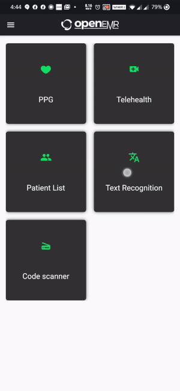
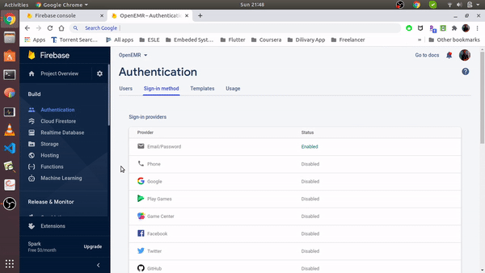

# OpenEMRv2.1.1

[OpenEMR](https://open-emr.org) is the most popular open source electronic health records and medical practice management solution. [ONC certified](https://open-emr.org/wiki/index.php/OpenEMR_Wiki_Home_Page#ONC_Ambulatory_EHR_Certification) with international usage, OpenEMR's goal is a superior alternative to its proprietary counterparts.

## What's New?
- Warnings has been removed
- Improved toast error message for firebase
- `google-services.json` has been added to `.gitignore`

## Version Info
`2.1.1` -> Current Version  
`2.1.2` -> Add Loading screens (Completed)  
`2.1.3` -> Remove deprecated function (Completed)   
`2.1.4` -> Error message based on API response (In Progress)  
`2.2` -> Medicine recognition  
.  
.  
.  
`3.0` -> All OpenEMR API will be support


## For Developers

If using OpenEMR directly from the code repository, then the following commands will build OpenEMR apk :

```shell
flutter pub get
flutter build apk|appbundle|ios|ios-framework
```

To run openemr in a device

```shell
flutter pub get
flutter run
```
### How to use calling feature
1. Run the [app-golang-openemr](https://github.com/openemr/app-golang-openemr/tree/c6930bb8f84e572234daaa071add316334a247f5)
2. Enter the server ip address in the prompt  
   

### How to Setup Firebase

#### Project Creation

1. Go to [Firebase console](https://console.firebase.google.com/)
2. Login and click on `Add Project` card  
   
3. Enter desired project name and click on `Continue` button  
   
4. Disable Google Analytics if you want but we suggest you to keep it as it is and click on `Continue` button  
   
5. Select default or desired account and click on `Continue`. (will not appear if you have disabled Google Analytics in previous step)  
   

#### Android - Connection

1. Select `Android` on home-page of your project  
   
2. Enter a `com.example.openemr` as package name. You can checkout this post if you want to [use custom package name](https://medium.com/@skyblazar.cc/how-to-change-the-package-name-of-your-flutter-app-4529e6e6e6fc)  
   
3. Enter the `SHA-1 hash`. [You can get the SHA-1 using this link](https://developers.google.com/android/guides/client-auth)
4. Click on `register app` button
5. Click on `Download google-services.json`. A json file will be downloaded to your desktop.  
   
6. Click on `next` button then again click on `next` button followed by `skip this step` button.
7. Place the `google-services.json` in `android/app` directory.
8. Go to `android/build.gradle` and uncomment `line 12`
9. Go to `android/app/build.gradle` and uncomment `line 26 & 65`

#### IOS - Connection

Coming soon

#### Enable Firebase services

1. Authentication(Used for login/register)  
   
   
2. Database(Used to store messages)  
   
3. Firestore(Used to store images shared in chat)  
   

#### Final step - turn firebase flag on

Go to `lib/screens/home.dart` and change `firebaseFlag` to `true` from `false`

```diff
- final firebaseFlag = false;
+ final firebaseFlag = true;
```

## License

[GNU GPL](LICENSE)
